## C
 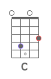 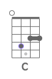  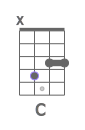 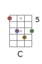 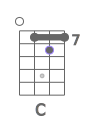 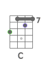  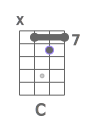  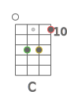 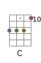 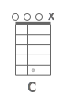  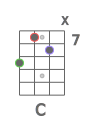 
## Cmaj
              
## Cm
                
## Cdim
     
## Cdim7
    
## Csus2
                
## Csus4
                  
## C7sus4
      
## Caug
               
## C6
                    
## C7
                    
## C7b5
    
## C9
   
## C9b5
    
## C7b9
   
## C7#9
  
## C11
    
## C9#11
                
## C13
   
## C13b9
   
## Cb13b9
    
## Cmaj7
              
## Cmaj7b5
    
## Cmaj7#5
    
## Cmaj9
      
## Cmaj11
  
## Cmaj13
 
## Cm6
                
## Cm7
             
## Cm7b5
    
## Cm9
   
## Cm11
 
## Cmmaj7
      
## Cmmaj9
                
## Cmmaj11
                
## Cadd9
      
## Cmadd9
   
## C#
 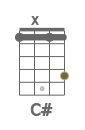 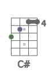 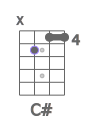  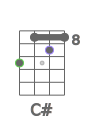  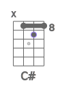  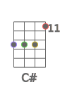  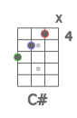  
## C#maj
   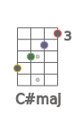  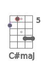  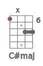 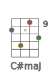 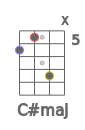 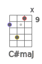 
## C#m
 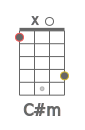  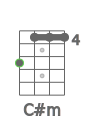 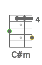   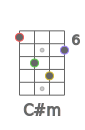 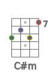 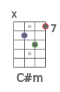 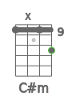 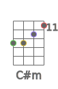 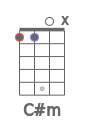 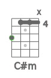 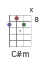 
## C#dim
 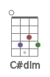 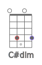 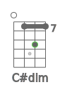 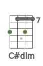 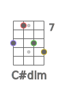 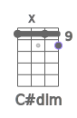 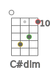 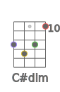 
## C#dim7
 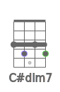 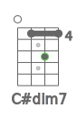 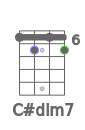 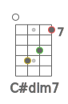 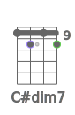 
## C#sus2
 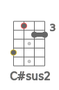 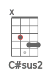           
## C#sus4
             
## C#7sus4
    
## C#aug
              
## C#6
                 
## C#7
               
## C#7b5
      
## C#9
  
## C#9b5
      
## C#7b9
 
## C#7#9
 
## C#11
    
## C#9#11
             
## C#13
   
## C#13b9
   
## C#maj7
           
## C#maj7b5
     
## C#maj7#5
     
## C#maj9
      
## C#maj11
  
## C#maj13

## C#m6
                 
## C#m7
               
## C#m7b5
     
## C#m9
     
## C#m11
  
## C#mmaj7
        
## C#mmaj9
               
## C#mmaj11
               
## C#add9
      
## C#madd9
     
## Db
             
## Dbmaj
           
## Dbm
               
## Dbdim
         
## Dbdim7
      
## Dbsus2
             
## Dbsus4
             
## Db7sus4
    
## Dbaug
              
## Db6
                 
## Db7
               
## Db7b5
      
## Db9
  
## Db9b5
      
## Db7b9
 
## Db7#9
 
## Db11
    
## Db9#11
             
## Db13
   
## Db13b9
   
## Dbmaj7
           
## Dbmaj7b5
     
## Dbmaj7#5
     
## Dbmaj9
      
## Dbmaj11
  
## Dbmaj13

## Dbm6
                 
## Dbm7
               
## Dbm7b5
     
## Dbm9
     
## Dbm11
  
## Dbmmaj7
        
## Dbmmaj9
               
## Dbmmaj11
               
## Dbadd9
      
## Dbmadd9
     
## D
             
## Dmaj
         
## Dm
             
## Ddim
    
## Ddim7
    
## Dsus2
             
## Dsus4
                   
## D7sus4
      
## Daug
              
## D6
                  
## D7
               
## D7b5
    
## D9
  
## D9b5
    
## D7b9
 
## D7#9
 
## D11
      
## D9#11
             
## D13
   
## D13b9
   
## Dmaj7
         
## Dmaj7b5
    
## Dmaj7#5
    
## Dmaj9
      
## Dmaj11
   
## Dmaj13

## Dm6
              
## Dm7
           
## Dm7b5
    
## Dm9
   
## Dm11
 
## Dmmaj7
     
## Dmmaj9
             
## Dmmaj11
             
## Dadd9
      
## Dmadd9
   
## D#
                    
## D#maj
             
## D#m
             
## D#dim
    
## D#dim7
    
## D#sus2
             
## D#sus4
             
## D#7sus4
    
## D#aug
                   
## D#6
                      
## D#7
                     
## D#7b5
      
## D#9
   
## D#9b5
      
## D#7b9
  
## D#7#9
   
## D#11
       
## D#9#11
                    
## D#13
   
## D#13b9
   
## D#maj7
             
## D#maj7b5
      
## D#maj7#5
    
## D#maj9
          
## D#maj11
    
## D#maj13

## D#m6
             
## D#m7
           
## D#m7b5
    
## D#m9
   
## D#m11
 
## D#mmaj7
     
## D#mmaj9
             
## D#mmaj11
             
## D#add9
          
## D#madd9
   
## Eb
                    
## Ebmaj
             
## Ebm
             
## Ebdim
    
## Ebdim7
    
## Ebsus2
             
## Ebsus4
             
## Eb7sus4
    
## Ebaug
                   
## Eb6
                      
## Eb7
                     
## Eb7b5
      
## Eb9
   
## Eb9b5
      
## Eb7b9
  
## Eb7#9
   
## Eb11
       
## Eb9#11
                    
## Eb13
   
## Eb13b9
   
## Ebmaj7
             
## Ebmaj7b5
      
## Ebmaj7#5
    
## Ebmaj9
          
## Ebmaj11
    
## Ebmaj13

## Ebm6
             
## Ebm7
           
## Ebm7b5
    
## Ebm9
   
## Ebm11
 
## Ebmmaj7
     
## Ebmmaj9
             
## Ebmmaj11
             
## Ebadd9
          
## Ebmadd9
   
## E
              
## Emaj
         
## Em
                    
## Edim
           
## Edim7
      
## Esus2
             
## Esus4
                
## E7sus4
     
## Eaug
                 
## E6
                   
## E7
               
## E7b5
    
## E9
  
## E9b5
    
## E7b9
 
## E7#9
    
## E11
    
## E9#11
              
## E13
    
## E13b9
    
## Emaj7
         
## Emaj7b5
     
## Emaj7#5
     
## Emaj9
      
## Emaj11
  
## Emaj13

## Em6
                   
## Em7
              
## Em7b5
     
## Em9
       
## Em11
  
## Emmaj7
       
## Emmaj9
                    
## Emmaj11
                    
## Eadd9
      
## Emadd9
       
## F
              
## Fmaj
           
## Fm
               
## Fdim
     
## Fdim7
    
## Fsus2
                   
## Fsus4
               
## F7sus4
    
## Faug
              
## F6
                 
## F7
               
## F7b5
     
## F9
    
## F9b5
     
## F7b9
 
## F7#9
  
## F11
     
## F9#11
              
## F13
   
## F13b9
   
## Fb13b9
    
## Fmaj7
           
## Fmaj7b5
    
## Fmaj7#5
    
## Fmaj9
           
## Fmaj11
   
## Fmaj13
  
## Fm6
             
## Fm7
           
## Fm7b5
    
## Fm9
       
## Fm11
   
## Fmmaj7
     
## Fmmaj9
               
## Fmmaj11
               
## Fadd9
           
## Fmadd9
       
## F#
             
## F#maj
         
## F#m
             
## F#dim
     
## F#dim7
    
## F#sus2
             
## F#sus4
             
## F#7sus4
    
## F#aug
              
## F#6
                 
## F#7
               
## F#7b5
    
## F#9
  
## F#9b5
    
## F#7b9
    
## F#7#9
  
## F#11
    
## F#9#11
             
## F#13
   
## F#13b9
   
## F#maj7
         
## F#maj7b5
    
## F#maj7#5
    
## F#maj9
      
## F#maj11
  
## F#maj13

## F#m6
             
## F#m7
             
## F#m7b5
    
## F#m9
   
## F#m11
  
## F#mmaj7
     
## F#mmaj9
             
## F#mmaj11
             
## F#add9
      
## F#madd9
   
## Gb
             
## Gbmaj
         
## Gbm
             
## Gbdim
     
## Gbdim7
    
## Gbsus2
             
## Gbsus4
             
## Gb7sus4
    
## Gbaug
              
## Gb6
                 
## Gb7
               
## Gb7b5
    
## Gb9
  
## Gb9b5
    
## Gb7b9
    
## Gb7#9
  
## Gb11
    
## Gb9#11
             
## Gb13
   
## Gb13b9
   
## Gbmaj7
         
## Gbmaj7b5
    
## Gbmaj7#5
    
## Gbmaj9
      
## Gbmaj11
  
## Gbmaj13

## Gbm6
             
## Gbm7
             
## Gbm7b5
    
## Gbm9
   
## Gbm11
  
## Gbmmaj7
     
## Gbmmaj9
             
## Gbmmaj11
             
## Gbadd9
      
## Gbmadd9
   
## G
                
## Gmaj
                
## Gm
                 
## Gdim
         
## Gdim7
      
## Gsus2
                   
## Gsus4
                  
## G7sus4
     
## Gaug
                   
## G6
                         
## G7
                        
## G7b5
      
## G9
    
## G9b5
      
## G7b9
    
## G7#9
   
## G11
     
## G9#11
                
## G13
     
## G13b9
     
## Gmaj7
                
## Gmaj7b5
      
## Gmaj7#5
      
## Gmaj9
            
## Gmaj11
   
## Gmaj13
  
## Gm6
                     
## Gm7
                   
## Gm7b5
      
## Gm9
       
## Gm11
   
## Gmmaj7
          
## Gmmaj9
                 
## Gmmaj11
                 
## Gadd9
            
## Gmadd9
       
## G#
               
## G#maj
                 
## G#m
             
## G#dim
     
## G#dim7
    
## G#sus2
             
## G#sus4
             
## G#7sus4
    
## G#aug
                 
## G#6
                  
## G#7
               
## G#7b5
    
## G#9
  
## G#9b5
    
## G#7b9
 
## G#7#9
 
## G#11
     
## G#9#11
               
## G#13
   
## G#13b9
   
## G#maj7
                 
## G#maj7b5
      
## G#maj7#5
       
## G#maj9
           
## G#maj11
      
## G#maj13
   
## G#m6
             
## G#m7
           
## G#m7b5
    
## G#m9
   
## G#m11
 
## G#mmaj7
           
## G#mmaj9
             
## G#mmaj11
             
## G#add9
           
## G#madd9
   
## Ab
               
## Abmaj
                 
## Abm
             
## Abdim
     
## Abdim7
    
## Absus2
             
## Absus4
             
## Ab7sus4
    
## Abaug
                 
## Ab6
                  
## Ab7
               
## Ab7b5
    
## Ab9
  
## Ab9b5
    
## Ab7b9
 
## Ab7#9
 
## Ab11
     
## Ab9#11
               
## Ab13
   
## Ab13b9
   
## Abmaj7
                 
## Abmaj7b5
      
## Abmaj7#5
       
## Abmaj9
           
## Abmaj11
      
## Abmaj13
   
## Abm6
             
## Abm7
           
## Abm7b5
    
## Abm9
   
## Abm11
 
## Abmmaj7
           
## Abmmaj9
             
## Abmmaj11
             
## Abadd9
           
## Abmadd9
   
## A
                
## Amaj
            
## Am
               
## Adim
     
## Adim7
    
## Asus2
                
## Asus4
             
## A7sus4
      
## Aaug
              
## A6
                 
## A7
                     
## A7b5
      
## A9
    
## A9b5
      
## A7b9
   
## A7#9
  
## A11
      
## A9#11
                
## A13
     
## A13b9
     
## Amaj7
            
## Amaj7b5
    
## Amaj7#5
    
## Amaj9
       
## Amaj11
  
## Amaj13

## Am6
             
## Am7
               
## Am7b5
       
## Am9
    
## Am11
  
## Ammaj7
          
## Ammaj9
               
## Ammaj11
               
## Aadd9
       
## Amadd9
    
## A#
             
## A#maj
         
## A#m
             
## A#dim
         
## A#dim7
      
## A#sus2
               
## A#sus4
             
## A#7sus4
    
## A#aug
              
## A#6
                       
## A#7
               
## A#7b5
    
## A#9
  
## A#9b5
    
## A#7b9
 
## A#7#9
 
## A#11
    
## A#9#11
             
## A#13
      
## A#13b9
      
## A#maj7
         
## A#maj7b5
    
## A#maj7#5
    
## A#maj9
      
## A#maj11
  
## A#maj13

## A#m6
                   
## A#m7
           
## A#m7b5
    
## A#m9
    
## A#m11
  
## A#mmaj7
      
## A#mmaj9
             
## A#mmaj11
             
## A#add9
      
## A#madd9
    
## Bb
             
## Bbmaj
         
## Bbm
             
## Bbdim
         
## Bbdim7
      
## Bbsus2
               
## Bbsus4
             
## Bb7sus4
    
## Bbaug
              
## Bb6
                       
## Bb7
               
## Bb7b5
    
## Bb9
  
## Bb9b5
    
## Bb7b9
 
## Bb7#9
 
## Bb11
    
## Bb9#11
             
## Bb13
      
## Bb13b9
      
## Bbmaj7
         
## Bbmaj7b5
    
## Bbmaj7#5
    
## Bbmaj9
      
## Bbmaj11
  
## Bbmaj13

## Bbm6
                   
## Bbm7
           
## Bbm7b5
    
## Bbm9
    
## Bbm11
  
## Bbmmaj7
      
## Bbmmaj9
             
## Bbmmaj11
             
## Bbadd9
      
## Bbmadd9
    
## B
             
## Bmaj
         
## Bm
             
## Bdim
     
## Bdim7
    
## Bsus2
             
## Bsus4
             
## B7sus4
     
## Baug
                   
## B6
                 
## B7
                
## B7b5
     
## B9
  
## B9b5
     
## B7b9
 
## B7#9
 
## B11
     
## B9#11
             
## B13
    
## B13b9
    
## Bmaj7
         
## Bmaj7b5
    
## Bmaj7#5
     
## Bmaj9
      
## Bmaj11
    
## Bmaj13

## Bm6
             
## Bm7
            
## Bm7b5
     
## Bm9
   
## Bm11
 
## Bmmaj7
     
## Bmmaj9
             
## Bmmaj11
             
## Badd9
      
## Bmadd9
   

