

	<h1>🎶 Ukulele Chords – A#</h1>
	

		<strong>Tuning:</strong> GCAE
	

	

    	<a href="https://github.com/capevace/ukulele-chords"><code>ukulele-chords</code> utility tool</a>
	

	 
	

		<a href="#A#maj">A#maj</a>, <a href="#A#m">A#m</a>, <a href="#A#dim">A#dim</a>, <a href="#A#dim7">A#dim7</a>, <a href="#A#sus2">A#sus2</a>, <a href="#A#sus4">A#sus4</a>, <a href="#A#7sus4">A#7sus4</a>, <a href="#A#alt">A#alt</a>, <a href="#A#aug">A#aug</a>, <a href="#A#6">A#6</a>, <a href="#A#69">A#69</a>, <a href="#A#7">A#7</a>, <a href="#A#7b5">A#7b5</a>, <a href="#A#aug7">A#aug7</a>, <a href="#A#9">A#9</a>, <a href="#A#9b5">A#9b5</a>, <a href="#A#aug9">A#aug9</a>, <a href="#A#7b9">A#7b9</a>, <a href="#A#7b9#5">A#7b9#5</a>, <a href="#A#7#9">A#7#9</a>, <a href="#A#11">A#11</a>, <a href="#A#9#11">A#9#11</a>, <a href="#A#13">A#13</a>, <a href="#A#13b9">A#13b9</a>, <a href="#A#13b5b9">A#13b5b9</a>, <a href="#A#b13b9">A#b13b9</a>, <a href="#A#b13#9">A#b13#9</a>, <a href="#A#maj7">A#maj7</a>, <a href="#A#maj7b5">A#maj7b5</a>, <a href="#A#maj7#5">A#maj7#5</a>, <a href="#A#maj9">A#maj9</a>, <a href="#A#maj11">A#maj11</a>, <a href="#A#maj13">A#maj13</a>, <a href="#A#m6">A#m6</a>, <a href="#A#m7">A#m7</a>, <a href="#A#m7b5">A#m7b5</a>, <a href="#A#m9">A#m9</a>, <a href="#A#m69">A#m69</a>, <a href="#A#m9b5">A#m9b5</a>, <a href="#A#m11">A#m11</a>, <a href="#A#mmaj7">A#mmaj7</a>, <a href="#A#mmaj7b5">A#mmaj7b5</a>, <a href="#A#mmaj9">A#mmaj9</a>, <a href="#A#mmaj11">A#mmaj11</a>, <a href="#A#add9">A#add9</a>, <a href="#A#madd9">A#madd9</a>
	

 

## A#maj

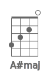 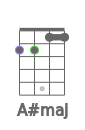  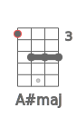 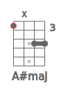 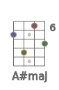 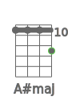 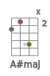  

## A#m

 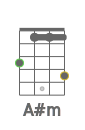 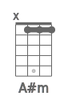  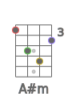 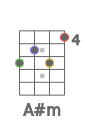 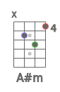 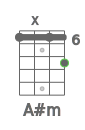 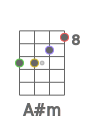 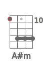 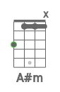 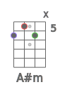 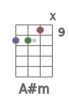 

## A#dim

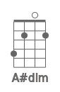 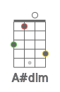 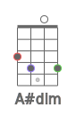 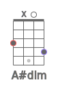 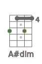 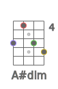  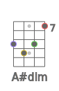 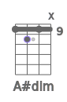 

## A#dim7

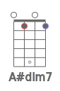 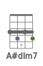 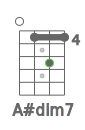 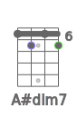 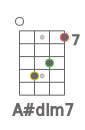 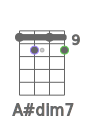 

## A#sus2

 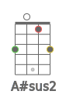 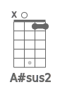 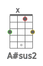 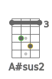 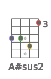 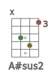 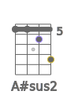 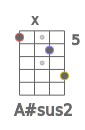 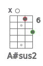 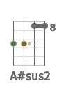 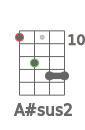  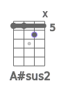 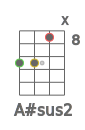 

## A#sus4

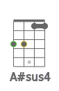 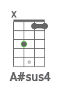 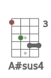 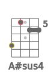 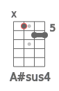         

## A#7sus4

    

## A#aug

              

## A#6

                       

## A#7

               

## A#7b5

    

## A#9

  

## A#9b5

    

## A#7b9

 

## A#7#9

 

## A#11

    

## A#9#11

             

## A#13

      

## A#13b9

      

## A#maj7

         

## A#maj7b5

    

## A#maj7#5

    

## A#maj9

      

## A#maj11

  

## A#maj13

## A#m6

                   

## A#m7

           

## A#m7b5

    

## A#m9

    

## A#m11

  

## A#mmaj7

      

## A#mmaj9

             

## A#mmaj11

             

## A#add9

      

## A#madd9

    

