

	<h1>🎶 Ukulele Chords – A</h1>
	

		<strong>Tuning:</strong> GCAE
	

	

    <a href="https://github.com/capevace/ukulele-chords"><code>ukulele-chords</code> utility tool</a>
	

 

## Amaj

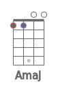            

## Am

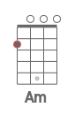               

## Adim

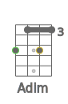     

## Adim7

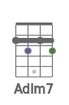    

## Asus2

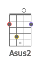                

## Asus4

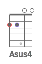             

## A7sus4

      

## Aaug

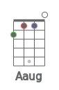              

## A6

                 

## A7

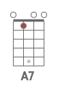      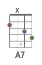               

## A7b5

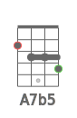  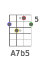    

## A9

    

## A9b5

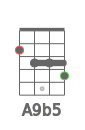      

## A7b9

   

## A7#9

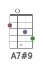  

## A11

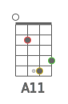      

## A9#11

                

## A13

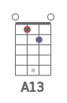     

## A13b9

     

## Ab13b9

   

## Amaj7

    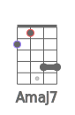   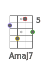     

## Amaj7b5

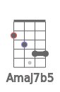    

## Amaj7#5

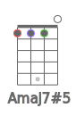    

## Amaj9

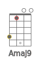       

## Amaj11

  

## Amaj13

## Am6

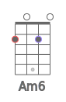   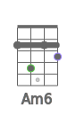          

## Am7

               

## Am7b5

       

## Am9

    

## Am11

  

## Ammaj7

          

## Ammaj9

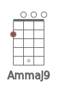               

## Ammaj11

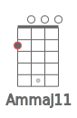               

## Aadd9

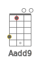       

## Amadd9

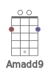   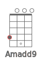 

