

	<h1>🎶 Ukulele Chords – Ab</h1>
	

		<strong>Tuning:</strong> GCAE
	

	

    <a href="https://github.com/capevace/ukulele-chords"><code>ukulele-chords</code> utility tool</a>
	

 
## Abmaj

  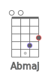               

## Abm

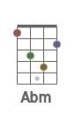             

## Abdim

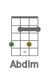     

## Abdim7

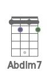    

## Absus2

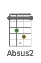             

## Absus4

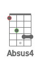             

## Ab7sus4

    

## Abaug

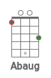                 

## Ab6

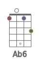                  

## Ab7

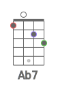               

## Ab7b5

   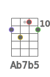 

## Ab9

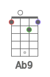  

## Ab9b5

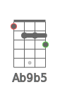    

## Ab7b9

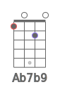 

## Ab7#9

 

## Ab11

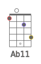     

## Ab9#11

               

## Ab13

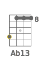   

## Ab13b9

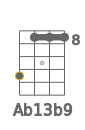   

## Abmaj7

                 

## Abmaj7b5

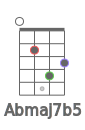      

## Abmaj7#5

       

## Abmaj9

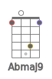  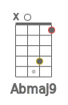         

## Abmaj11

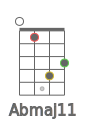      

## Abmaj13

   

## Abm6

  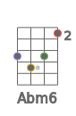           

## Abm7

           

## Abm7b5

   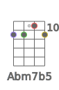 

## Abm9

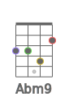  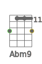 

## Abm11

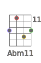 

## Abmmaj7

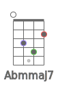           

## Abmmaj9

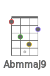             

## Abmmaj11

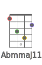             

## Abadd9

   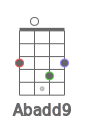        

## Abmadd9

   

