

	<h1>🎶 Ukulele Chords – B</h1>
	

		<strong>Tuning:</strong> GCAE
	

	

    	<a href="https://github.com/capevace/ukulele-chords"><code>ukulele-chords</code> utility tool</a>
	

	 
	

		<a href="#Bmaj">Bmaj</a>, <a href="#Bm">Bm</a>, <a href="#Bdim">Bdim</a>, <a href="#Bdim7">Bdim7</a>, <a href="#Bsus2">Bsus2</a>, <a href="#Bsus4">Bsus4</a>, <a href="#B7sus4">B7sus4</a>, <a href="#Baug">Baug</a>, <a href="#B6">B6</a>, <a href="#B7">B7</a>, <a href="#B7b5">B7b5</a>, <a href="#B9">B9</a>, <a href="#B9b5">B9b5</a>, <a href="#B7b9">B7b9</a>, <a href="#B7#9">B7#9</a>, <a href="#B11">B11</a>, <a href="#B9#11">B9#11</a>, <a href="#B13">B13</a>, <a href="#B13b9">B13b9</a>, <a href="#Bb13b9">Bb13b9</a>, <a href="#Bmaj7">Bmaj7</a>, <a href="#Bmaj7b5">Bmaj7b5</a>, <a href="#Bmaj7#5">Bmaj7#5</a>, <a href="#Bmaj9">Bmaj9</a>, <a href="#Bmaj11">Bmaj11</a>, <a href="#Bmaj13">Bmaj13</a>, <a href="#Bm6">Bm6</a>, <a href="#Bm7">Bm7</a>, <a href="#Bm7b5">Bm7b5</a>, <a href="#Bm9">Bm9</a>, <a href="#Bm11">Bm11</a>, <a href="#Bmmaj7">Bmmaj7</a>, <a href="#Bmmaj9">Bmmaj9</a>, <a href="#Bmmaj11">Bmmaj11</a>, <a href="#Badd9">Badd9</a>, <a href="#Bmadd9">Bmadd9</a>
	

 

## Bmaj

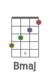 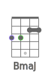 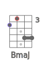 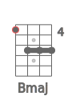 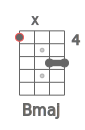 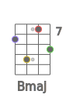 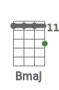 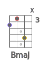 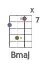 

## Bm

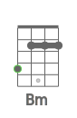 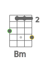 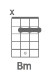  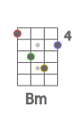 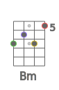 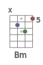 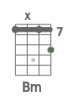 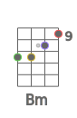 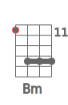  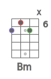 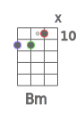 

## Bdim

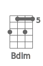 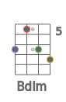 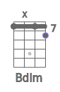 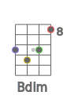 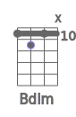 

## Bdim7

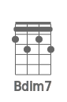 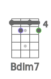 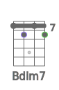  

## Bsus2

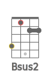 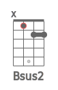   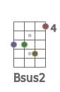 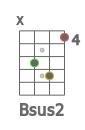 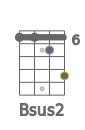  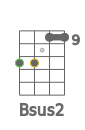 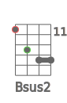 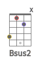 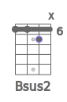 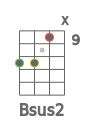 

## Bsus4

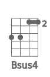  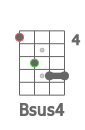 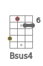 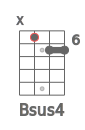 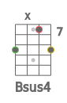 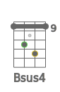  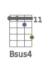 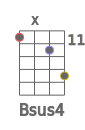 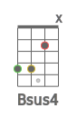 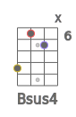 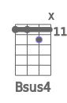 

## B7sus4

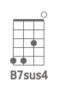     

## Baug

                   

## B6

                 

## B7

                

## B7b5

     

## B9

  

## B9b5

     

## B7b9

 

## B7#9

 

## B11

     

## B9#11

             

## B13

    

## B13b9

    

## Bb13b9

      

## Bmaj7

         

## Bmaj7b5

    

## Bmaj7#5

     

## Bmaj9

      

## Bmaj11

    

## Bmaj13

## Bm6

             

## Bm7

            

## Bm7b5

     

## Bm9

   

## Bm11

 

## Bmmaj7

     

## Bmmaj9

             

## Bmmaj11

             

## Badd9

      

## Bmadd9

   

