

	<h1>🎶 Ukulele Chords – Bb</h1>
	

		<strong>Tuning:</strong> GCAE
	

	

    	<a href="https://github.com/capevace/ukulele-chords"><code>ukulele-chords</code> utility tool</a>
	

	 
	

		<a href="#Bbmaj">Bbmaj</a>, <a href="#Bbm">Bbm</a>, <a href="#Bbdim">Bbdim</a>, <a href="#Bbdim7">Bbdim7</a>, <a href="#Bbsus2">Bbsus2</a>, <a href="#Bbsus4">Bbsus4</a>, <a href="#Bb7sus4">Bb7sus4</a>, <a href="#Bbaug">Bbaug</a>, <a href="#Bb6">Bb6</a>, <a href="#Bb7">Bb7</a>, <a href="#Bb7b5">Bb7b5</a>, <a href="#Bb9">Bb9</a>, <a href="#Bb9b5">Bb9b5</a>, <a href="#Bb7b9">Bb7b9</a>, <a href="#Bb7#9">Bb7#9</a>, <a href="#Bb11">Bb11</a>, <a href="#Bb9#11">Bb9#11</a>, <a href="#Bb13">Bb13</a>, <a href="#Bb13b9">Bb13b9</a>, <a href="#Bbmaj7">Bbmaj7</a>, <a href="#Bbmaj7b5">Bbmaj7b5</a>, <a href="#Bbmaj7#5">Bbmaj7#5</a>, <a href="#Bbmaj9">Bbmaj9</a>, <a href="#Bbmaj11">Bbmaj11</a>, <a href="#Bbmaj13">Bbmaj13</a>, <a href="#Bbm6">Bbm6</a>, <a href="#Bbm7">Bbm7</a>, <a href="#Bbm7b5">Bbm7b5</a>, <a href="#Bbm9">Bbm9</a>, <a href="#Bbm11">Bbm11</a>, <a href="#Bbmmaj7">Bbmmaj7</a>, <a href="#Bbmmaj9">Bbmmaj9</a>, <a href="#Bbmmaj11">Bbmmaj11</a>, <a href="#Bbadd9">Bbadd9</a>, <a href="#Bbmadd9">Bbmadd9</a>
	

 

## Bbmaj

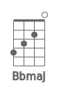 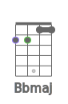 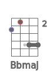 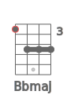 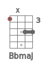 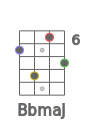 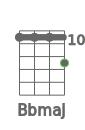 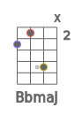 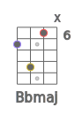 

## Bbm

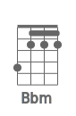 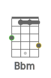 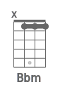 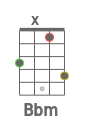 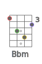 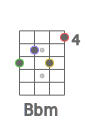 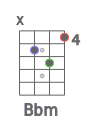 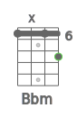 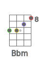 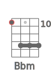 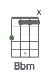 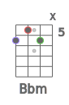 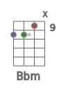 

## Bbdim

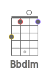 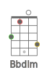 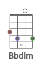 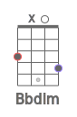 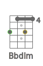 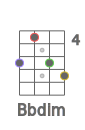 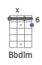 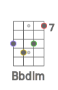  

## Bbdim7

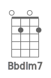 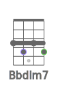 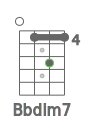 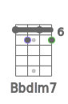 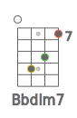  

## Bbsus2

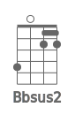 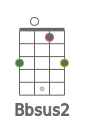  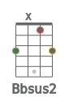 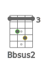  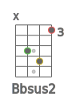 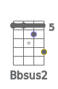 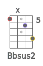 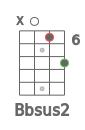 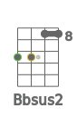 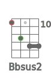 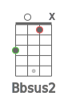 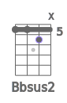 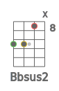 

## Bbsus4

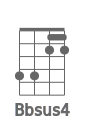 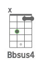            

## Bb7sus4

    

## Bbaug

              

## Bb6

                       

## Bb7

               

## Bb7b5

    

## Bb9

  

## Bb9b5

    

## Bb7b9

 

## Bb7#9

 

## Bb11

    

## Bb9#11

             

## Bb13

      

## Bb13b9

      

## Bbmaj7

         

## Bbmaj7b5

    

## Bbmaj7#5

    

## Bbmaj9

      

## Bbmaj11

  

## Bbmaj13

## Bbm6

                   

## Bbm7

           

## Bbm7b5

    

## Bbm9

    

## Bbm11

  

## Bbmmaj7

      

## Bbmmaj9

             

## Bbmmaj11

             

## Bbadd9

      

## Bbmadd9

    

