

	<h1>🎶 Ukulele Chords – C#</h1>
	

		<strong>Tuning:</strong> GCAE
	

	

    	<a href="https://github.com/capevace/ukulele-chords"><code>ukulele-chords</code> utility tool</a>
	

	 
	

		<a href="#C#11">C#11</a>, <a href="#C#13">C#13</a>, <a href="#C#13b5b9">C#13b5b9</a>, <a href="#C#13b9">C#13b9</a>, <a href="#C#6">C#6</a>, <a href="#C#69">C#69</a>, <a href="#C#7">C#7</a>, <a href="#C#7#9">C#7#9</a>, <a href="#C#7b5">C#7b5</a>, <a href="#C#7b9">C#7b9</a>, <a href="#C#7b9#5">C#7b9#5</a>, <a href="#C#7sus4">C#7sus4</a>, <a href="#C#9">C#9</a>, <a href="#C#9#11">C#9#11</a>, <a href="#C#9b5">C#9b5</a>, <a href="#C#add9">C#add9</a>, <a href="#C#alt">C#alt</a>, <a href="#C#aug">C#aug</a>, <a href="#C#aug7">C#aug7</a>, <a href="#C#aug9">C#aug9</a>, <a href="#C#b13#9">C#b13#9</a>, <a href="#C#b13b9">C#b13b9</a>, <a href="#C#dim">C#dim</a>, <a href="#C#dim7">C#dim7</a>, <a href="#C#m">C#m</a>, <a href="#C#m11">C#m11</a>, <a href="#C#m6">C#m6</a>, <a href="#C#m69">C#m69</a>, <a href="#C#m7">C#m7</a>, <a href="#C#m7b5">C#m7b5</a>, <a href="#C#m9">C#m9</a>, <a href="#C#m9b5">C#m9b5</a>, <a href="#C#madd9">C#madd9</a>, <a href="#C#maj">C#maj</a>, <a href="#C#maj11">C#maj11</a>, <a href="#C#maj13">C#maj13</a>, <a href="#C#maj7">C#maj7</a>, <a href="#C#maj7#5">C#maj7#5</a>, <a href="#C#maj7b5">C#maj7b5</a>, <a href="#C#maj9">C#maj9</a>, <a href="#C#mmaj11">C#mmaj11</a>, <a href="#C#mmaj7">C#mmaj7</a>, <a href="#C#mmaj7b5">C#mmaj7b5</a>, <a href="#C#mmaj9">C#mmaj9</a>, <a href="#C#sus2">C#sus2</a>, <a href="#C#sus4">C#sus4</a>
	

 

## C#maj

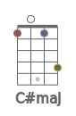       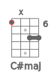 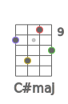 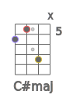  

## C#m

 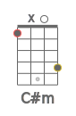   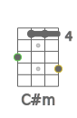   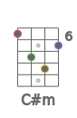 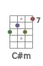 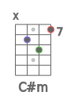 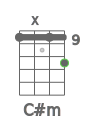   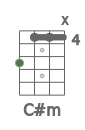 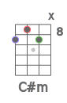 

## C#dim

   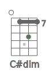 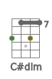   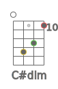  

## C#dim7

 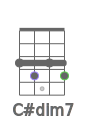 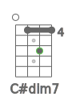 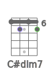   

## C#sus2

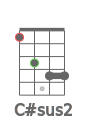   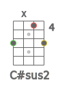  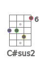    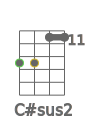  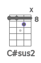  

## C#sus4

 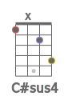    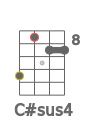    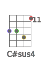  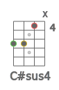 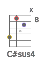 

## C#7sus4

 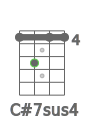 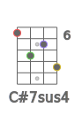 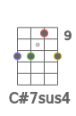 

## C#aug

 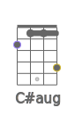   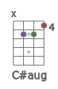  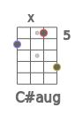 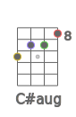  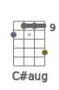    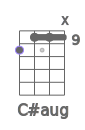 

## C#6

 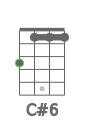 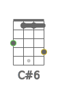 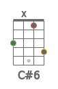 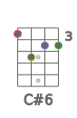   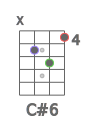 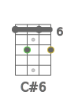 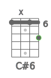 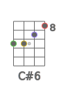 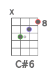 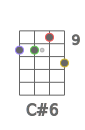 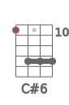  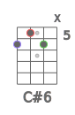  

## C#7

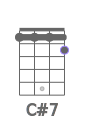               

## C#7b5

      

## C#9

  

## C#9b5

      

## C#7b9

 

## C#7#9

 

## C#11

    

## C#9#11

             

## C#13

   

## C#13b9

   

## C#maj7

           

## C#maj7b5

     

## C#maj7#5

     

## C#maj9

      

## C#maj11

  

## C#maj13

## C#m6

                 

## C#m7

               

## C#m7b5

     

## C#m9

     

## C#m11

  

## C#mmaj7

        

## C#mmaj9

               

## C#mmaj11

               

## C#add9

      

## C#madd9

     

