

	<h1>🎶 Ukulele Chords – C</h1>
	

		<strong>Tuning:</strong> GCAE
	

	

    	<a href="https://github.com/capevace/ukulele-chords"><code>ukulele-chords</code> utility tool</a>
	

	 
	

		<a href="#Cmaj">Cmaj</a>, <a href="#Cm">Cm</a>, <a href="#Cdim">Cdim</a>, <a href="#Cdim7">Cdim7</a>, <a href="#Csus2">Csus2</a>, <a href="#Csus4">Csus4</a>, <a href="#C7sus4">C7sus4</a>, <a href="#Caug">Caug</a>, <a href="#C6">C6</a>, <a href="#C7">C7</a>, <a href="#C7b5">C7b5</a>, <a href="#C9">C9</a>, <a href="#C9b5">C9b5</a>, <a href="#C7b9">C7b9</a>, <a href="#C7#9">C7#9</a>, <a href="#C11">C11</a>, <a href="#C9#11">C9#11</a>, <a href="#C13">C13</a>, <a href="#C13b9">C13b9</a>, <a href="#Cb13b9">Cb13b9</a>, <a href="#Cmaj7">Cmaj7</a>, <a href="#Cmaj7b5">Cmaj7b5</a>, <a href="#Cmaj7#5">Cmaj7#5</a>, <a href="#Cmaj9">Cmaj9</a>, <a href="#Cmaj11">Cmaj11</a>, <a href="#Cmaj13">Cmaj13</a>, <a href="#Cm6">Cm6</a>, <a href="#Cm7">Cm7</a>, <a href="#Cm7b5">Cm7b5</a>, <a href="#Cm9">Cm9</a>, <a href="#Cm11">Cm11</a>, <a href="#Cmmaj7">Cmmaj7</a>, <a href="#Cmmaj9">Cmmaj9</a>, <a href="#Cmmaj11">Cmmaj11</a>, <a href="#Cadd9">Cadd9</a>, <a href="#Cmadd9">Cmadd9</a>
	

 

## Cmaj

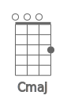 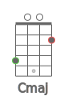  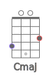 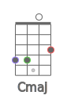 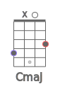 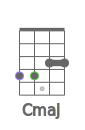 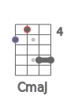 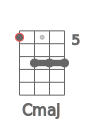 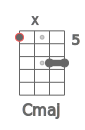 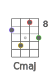 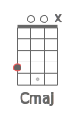  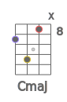 

## Cm

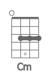 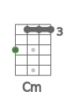 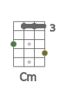 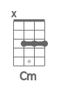  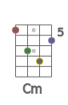 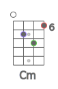 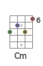 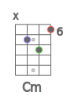 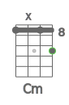 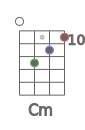 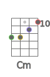 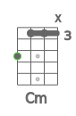 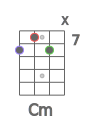 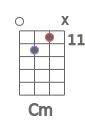 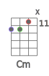 

## Cdim

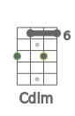  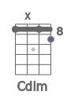 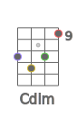 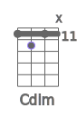 

## Cdim7

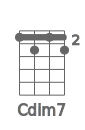 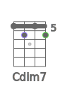 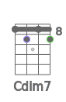 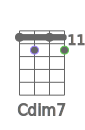 

## Csus2

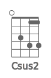 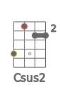 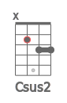 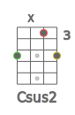 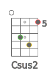 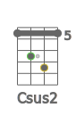 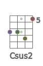 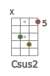 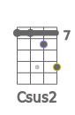 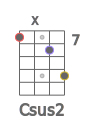 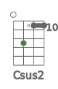 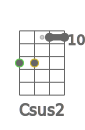 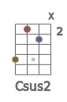 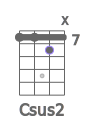 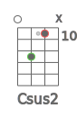  

## Csus4

                  

## C7sus4

      

## Caug

               

## C6

                    

## C7

                    

## C7b5

    

## C9

   

## C9b5

    

## C7b9

   

## C7#9

  

## C11

    

## C9#11

                

## C13

   

## C13b9

   

## Cb13b9

    

## Cmaj7

              

## Cmaj7b5

    

## Cmaj7#5

    

## Cmaj9

      

## Cmaj11

  

## Cmaj13

 

## Cm6

                

## Cm7

             

## Cm7b5

    

## Cm9

   

## Cm11

 

## Cmmaj7

      

## Cmmaj9

                

## Cmmaj11

                

## Cadd9

      

## Cmadd9

   

