

	<h1>🎶 Ukulele Chords – D#</h1>
	

		<strong>Tuning:</strong> GCAE
	

	

    	<a href="https://github.com/capevace/ukulele-chords"><code>ukulele-chords</code> utility tool</a>
	

	 
	

		<a href="#D#11">D#11</a>, <a href="#D#13">D#13</a>, <a href="#D#13b9">D#13b9</a>, <a href="#D#6">D#6</a>, <a href="#D#7">D#7</a>, <a href="#D#7#9">D#7#9</a>, <a href="#D#7b5">D#7b5</a>, <a href="#D#7b9">D#7b9</a>, <a href="#D#7sus4">D#7sus4</a>, <a href="#D#9">D#9</a>, <a href="#D#9#11">D#9#11</a>, <a href="#D#9b5">D#9b5</a>, <a href="#D#add9">D#add9</a>, <a href="#D#aug">D#aug</a>, <a href="#D#dim">D#dim</a>, <a href="#D#dim7">D#dim7</a>, <a href="#D#m">D#m</a>, <a href="#D#m11">D#m11</a>, <a href="#D#m6">D#m6</a>, <a href="#D#m7">D#m7</a>, <a href="#D#m7b5">D#m7b5</a>, <a href="#D#m9">D#m9</a>, <a href="#D#madd9">D#madd9</a>, <a href="#D#maj">D#maj</a>, <a href="#D#maj11">D#maj11</a>, <a href="#D#maj13">D#maj13</a>, <a href="#D#maj7">D#maj7</a>, <a href="#D#maj7#5">D#maj7#5</a>, <a href="#D#maj7b5">D#maj7b5</a>, <a href="#D#maj9">D#maj9</a>, <a href="#D#mmaj11">D#mmaj11</a>, <a href="#D#mmaj7">D#mmaj7</a>, <a href="#D#mmaj9">D#mmaj9</a>, <a href="#D#sus2">D#sus2</a>, <a href="#D#sus4">D#sus4</a>
	

 

## D#maj

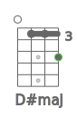   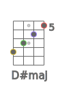        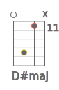 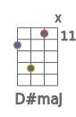 

## D#m

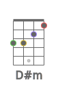      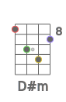     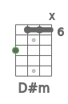  

## D#dim

    

## D#dim7

    

## D#sus2

             

## D#sus4

             

## D#7sus4

    

## D#aug

           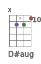  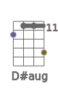      

## D#6

                      

## D#7

                    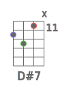 

## D#7b5

      

## D#9

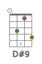   

## D#9b5

      

## D#7b9

  

## D#7#9

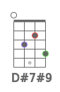   

## D#11

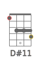       

## D#9#11

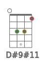                    

## D#13

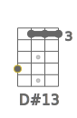   

## D#13b9

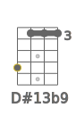   

## D#maj7

             

## D#maj7b5

      

## D#maj7#5

    

## D#maj9

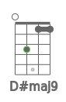          

## D#maj11

    

## D#maj13

## D#m6

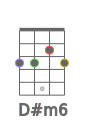             

## D#m7

          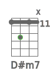 

## D#m7b5

    

## D#m9

   

## D#m11

 

## D#mmaj7

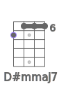     

## D#mmaj9

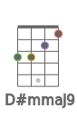          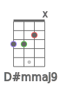   

## D#mmaj11

             

## D#add9

          

## D#madd9

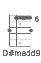   

