

	<h1>🎶 Ukulele Chords – D</h1>
	

		<strong>Tuning:</strong> GCAE
	

	

    <a href="https://github.com/capevace/ukulele-chords"><code>ukulele-chords</code> utility tool</a>
	

 

## Dmaj

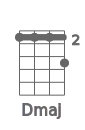  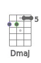 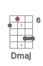 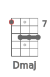 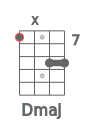 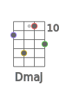 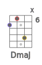 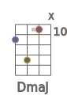 

## Dm

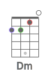 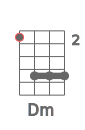  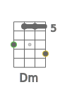 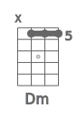 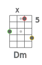 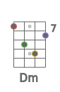 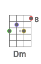 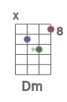 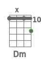 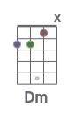 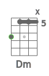  

## Ddim

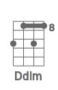 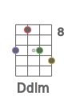 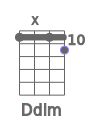 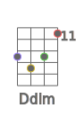 

## Ddim7

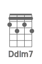 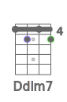 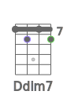 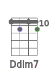 

## Dsus2

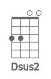  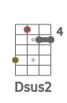 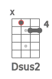 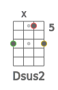 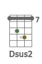 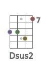 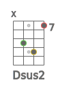  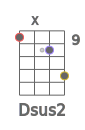 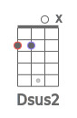 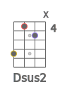 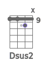 

## Dsus4

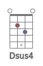 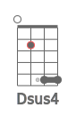 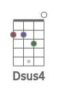 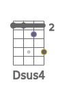  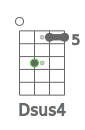 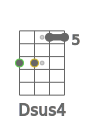 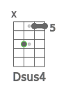 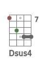 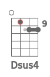 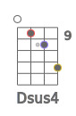 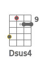 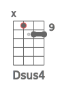       

## D7sus4

      

## Daug

              

## D6

                  

## D7

               

## D7b5

    

## D9

  

## D9b5

    

## D7b9

 

## D7#9

 

## D11

      

## D9#11

             

## D13

   

## D13b9

   

## Db13b9

   

## Dmaj7

         

## Dmaj7b5

    

## Dmaj7#5

    

## Dmaj9

      

## Dmaj11

   

## Dmaj13

## Dm6

              

## Dm7

           

## Dm7b5

    

## Dm9

   

## Dm11

 

## Dmmaj7

     

## Dmmaj9

             

## Dmmaj11

             

## Dadd9

      

## Dmadd9

   

