

	<h1>🎶 Ukulele Chords – E</h1>
	

		<strong>Tuning:</strong> GCAE
	

	

    <a href="https://github.com/capevace/ukulele-chords"><code>ukulele-chords</code> utility tool</a>
	

 
## Emaj
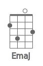 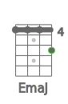 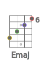 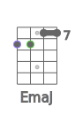 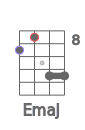  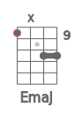 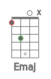 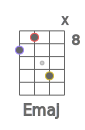 
## Em
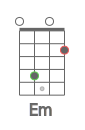 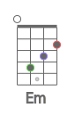 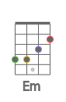 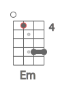 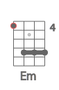 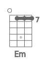 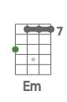 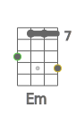 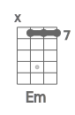 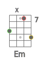 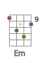 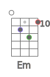 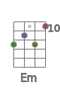 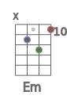 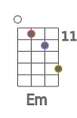 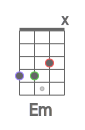 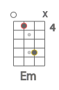 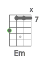 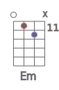 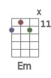 
## Edim
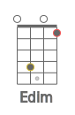 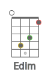 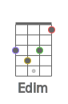 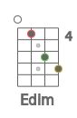 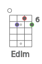 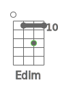 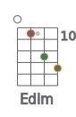 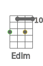 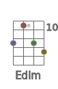 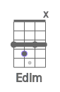 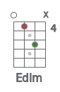 
## Edim7
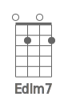 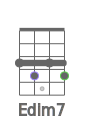 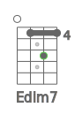 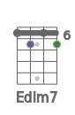 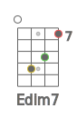 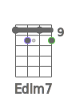 
## Esus2
 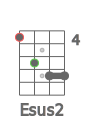 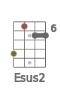 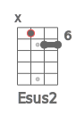  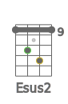 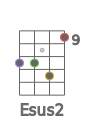       
## Esus4
                
## E7sus4
     
## Eaug
                 
## E6
                   
## E7
               
## E7b5
    
## E9
  
## E9b5
    
## E7b9
 
## E7#9
    
## E11
    
## E9#11
              
## E13
    
## E13b9
    
## Eb13b9
   
## Emaj7
         
## Emaj7b5
     
## Emaj7#5
     
## Emaj9
      
## Emaj11
  
## Emaj13

## Em6
                   
## Em7
              
## Em7b5
     
## Em9
       
## Em11
  
## Emmaj7
       
## Emmaj9
                    
## Emmaj11
                    
## Eadd9
      
## Emadd9
       
