

	<h1>🎶 Ukulele Chords – Eb</h1>
	

		<strong>Tuning:</strong> GCAE
	

	

    <a href="https://github.com/capevace/ukulele-chords"><code>ukulele-chords</code> utility tool</a>
	

 
## Ebmaj

      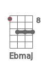       

## Ebm

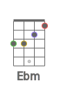     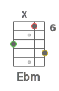        

## Ebdim

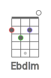    

## Ebdim7

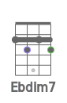    

## Ebsus2

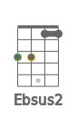             

## Ebsus4

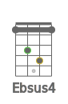             

## Eb7sus4

    

## Ebaug

                   

## Eb6

            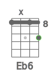          

## Eb7

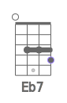                     

## Eb7b5

      

## Eb9

   

## Eb9b5

      

## Eb7b9

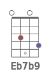  

## Eb7#9

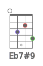   

## Eb11

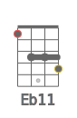       

## Eb9#11

                   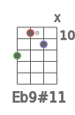 

## Eb13

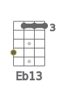   

## Eb13b9

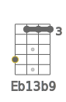   

## Ebmaj7

             

## Ebmaj7b5

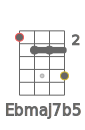      

## Ebmaj7#5

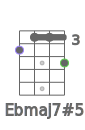    

## Ebmaj9

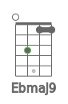  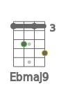        

## Ebmaj11

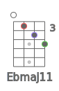    

## Ebmaj13

## Ebm6

             

## Ebm7

           

## Ebm7b5

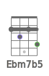    

## Ebm9

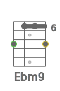   

## Ebm11

 

## Ebmmaj7

     

## Ebmmaj9

             

## Ebmmaj11

           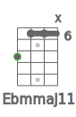  

## Ebadd9

          

## Ebmadd9

   

