

	<h1>🎶 Ukulele Chords – F#</h1>
	

		<strong>Tuning:</strong> GCAE
	

	

    	<a href="https://github.com/capevace/ukulele-chords"><code>ukulele-chords</code> utility tool</a>
	

	 
	

		<a href="#F#11">F#11</a>, <a href="#F#13">F#13</a>, <a href="#F#13b9">F#13b9</a>, <a href="#F#6">F#6</a>, <a href="#F#7">F#7</a>, <a href="#F#7#9">F#7#9</a>, <a href="#F#7b5">F#7b5</a>, <a href="#F#7b9">F#7b9</a>, <a href="#F#7sus4">F#7sus4</a>, <a href="#F#9">F#9</a>, <a href="#F#9#11">F#9#11</a>, <a href="#F#9b5">F#9b5</a>, <a href="#F#add9">F#add9</a>, <a href="#F#aug">F#aug</a>, <a href="#F#dim">F#dim</a>, <a href="#F#dim7">F#dim7</a>, <a href="#F#m">F#m</a>, <a href="#F#m11">F#m11</a>, <a href="#F#m6">F#m6</a>, <a href="#F#m7">F#m7</a>, <a href="#F#m7b5">F#m7b5</a>, <a href="#F#m9">F#m9</a>, <a href="#F#madd9">F#madd9</a>, <a href="#F#maj">F#maj</a>, <a href="#F#maj11">F#maj11</a>, <a href="#F#maj13">F#maj13</a>, <a href="#F#maj7">F#maj7</a>, <a href="#F#maj7#5">F#maj7#5</a>, <a href="#F#maj7b5">F#maj7b5</a>, <a href="#F#maj9">F#maj9</a>, <a href="#F#mmaj11">F#mmaj11</a>, <a href="#F#mmaj7">F#mmaj7</a>, <a href="#F#mmaj9">F#mmaj9</a>, <a href="#F#sus2">F#sus2</a>, <a href="#F#sus4">F#sus4</a>
	

 

## F#maj

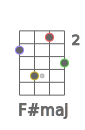 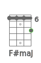 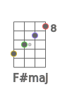 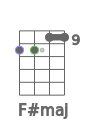 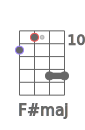 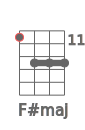 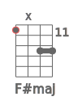 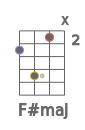 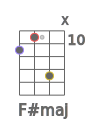 

## F#m

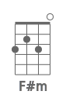 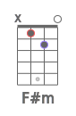 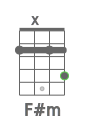 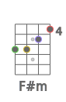 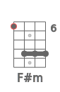 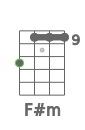 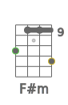 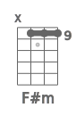 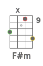 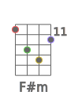 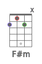 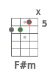 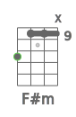 

## F#dim

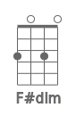 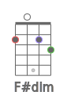  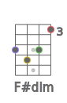 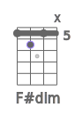 

## F#dim7

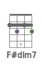 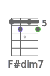   

## F#sus2

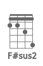 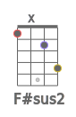 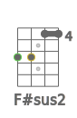 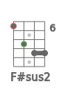 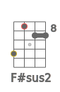 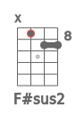 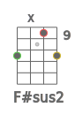 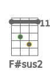 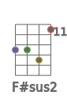 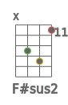 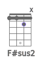 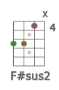 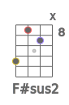 

## F#sus4

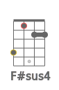  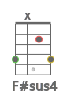 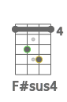  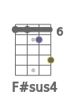 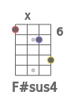 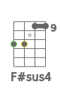 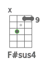 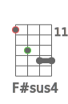 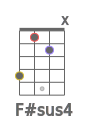   

## F#7sus4

    

## F#aug

              

## F#6

                 

## F#7

               

## F#7b5

    

## F#9

  

## F#9b5

    

## F#7b9

    

## F#7#9

  

## F#11

    

## F#9#11

             

## F#13

   

## F#13b9

   

## F#maj7

         

## F#maj7b5

    

## F#maj7#5

    

## F#maj9

      

## F#maj11

  

## F#maj13

## F#m6

             

## F#m7

             

## F#m7b5

    

## F#m9

   

## F#m11

  

## F#mmaj7

     

## F#mmaj9

             

## F#mmaj11

             

## F#add9

      

## F#madd9

   

