

	<h1>🎶 Ukulele Chords – F</h1>
	

		<strong>Tuning:</strong> GCAE
	

	

    	<a href="https://github.com/capevace/ukulele-chords"><code>ukulele-chords</code> utility tool</a>
	

	 
	

		<a href="#Fmaj">Fmaj</a>, <a href="#Fm">Fm</a>, <a href="#Fdim">Fdim</a>, <a href="#Fdim7">Fdim7</a>, <a href="#Fsus2">Fsus2</a>, <a href="#Fsus4">Fsus4</a>, <a href="#F7sus4">F7sus4</a>, <a href="#Faug">Faug</a>, <a href="#F6">F6</a>, <a href="#F7">F7</a>, <a href="#F7b5">F7b5</a>, <a href="#F9">F9</a>, <a href="#F9b5">F9b5</a>, <a href="#F7b9">F7b9</a>, <a href="#F7#9">F7#9</a>, <a href="#F11">F11</a>, <a href="#F9#11">F9#11</a>, <a href="#F13">F13</a>, <a href="#F13b9">F13b9</a>, <a href="#Fb13b9">Fb13b9</a>, <a href="#Fmaj7">Fmaj7</a>, <a href="#Fmaj7b5">Fmaj7b5</a>, <a href="#Fmaj7#5">Fmaj7#5</a>, <a href="#Fmaj9">Fmaj9</a>, <a href="#Fmaj11">Fmaj11</a>, <a href="#Fmaj13">Fmaj13</a>, <a href="#Fm6">Fm6</a>, <a href="#Fm7">Fm7</a>, <a href="#Fm7b5">Fm7b5</a>, <a href="#Fm9">Fm9</a>, <a href="#Fm11">Fm11</a>, <a href="#Fmmaj7">Fmmaj7</a>, <a href="#Fmmaj9">Fmmaj9</a>, <a href="#Fmmaj11">Fmmaj11</a>, <a href="#Fadd9">Fadd9</a>, <a href="#Fmadd9">Fmadd9</a>
	

 

## Fmaj

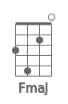 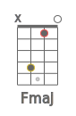  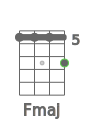 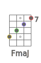 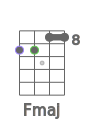 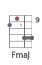 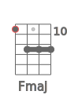 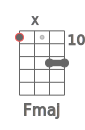 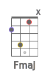  

## Fm

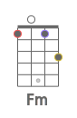 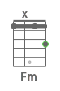 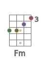 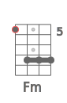 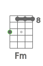 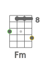 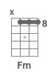 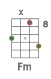 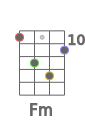 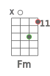 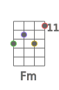 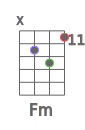 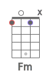 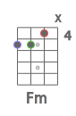 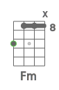 

## Fdim

 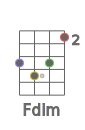 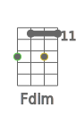 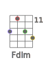 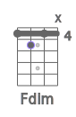 

## Fdim7

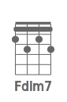 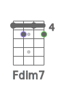 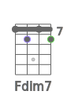 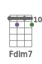 

## Fsus2

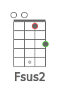 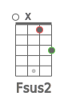 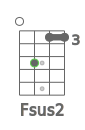 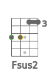 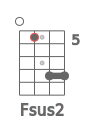 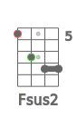 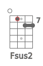 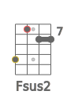 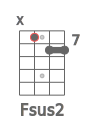 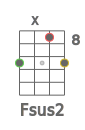 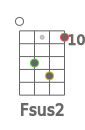 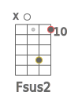 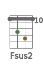 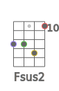 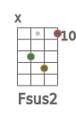 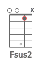  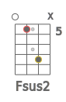 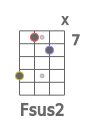 

## Fsus4

               

## F7sus4

    

## Faug

              

## F6

                 

## F7

               

## F7b5

     

## F9

    

## F9b5

     

## F7b9

 

## F7#9

  

## F11

     

## F9#11

              

## F13

   

## F13b9

   

## Fb13b9

    

## Fmaj7

           

## Fmaj7b5

    

## Fmaj7#5

    

## Fmaj9

           

## Fmaj11

   

## Fmaj13

  

## Fm6

             

## Fm7

           

## Fm7b5

    

## Fm9

       

## Fm11

   

## Fmmaj7

     

## Fmmaj9

               

## Fmmaj11

               

## Fadd9

           

## Fmadd9

       

