

	<h1>🎶 Ukulele Chords – G#</h1>
	

		<strong>Tuning:</strong> GCAE
	

	

    	<a href="https://github.com/capevace/ukulele-chords"><code>ukulele-chords</code> utility tool</a>
	

	 
	

		<a href="#G#11">G#11</a>, <a href="#G#13">G#13</a>, <a href="#G#13b9">G#13b9</a>, <a href="#G#6">G#6</a>, <a href="#G#7">G#7</a>, <a href="#G#7#9">G#7#9</a>, <a href="#G#7b5">G#7b5</a>, <a href="#G#7b9">G#7b9</a>, <a href="#G#7sus4">G#7sus4</a>, <a href="#G#9">G#9</a>, <a href="#G#9#11">G#9#11</a>, <a href="#G#9b5">G#9b5</a>, <a href="#G#add9">G#add9</a>, <a href="#G#aug">G#aug</a>, <a href="#G#dim">G#dim</a>, <a href="#G#dim7">G#dim7</a>, <a href="#G#m">G#m</a>, <a href="#G#m11">G#m11</a>, <a href="#G#m6">G#m6</a>, <a href="#G#m7">G#m7</a>, <a href="#G#m7b5">G#m7b5</a>, <a href="#G#m9">G#m9</a>, <a href="#G#madd9">G#madd9</a>, <a href="#G#maj">G#maj</a>, <a href="#G#maj11">G#maj11</a>, <a href="#G#maj13">G#maj13</a>, <a href="#G#maj7">G#maj7</a>, <a href="#G#maj7#5">G#maj7#5</a>, <a href="#G#maj7b5">G#maj7b5</a>, <a href="#G#maj9">G#maj9</a>, <a href="#G#mmaj11">G#mmaj11</a>, <a href="#G#mmaj7">G#mmaj7</a>, <a href="#G#mmaj9">G#mmaj9</a>, <a href="#G#sus2">G#sus2</a>, <a href="#G#sus4">G#sus4</a>
	

 

## G#maj

                 

## G#m

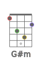             

## G#dim

     

## G#dim7

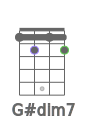    

## G#sus2

        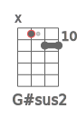     

## G#sus4

        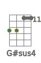 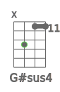    

## G#7sus4

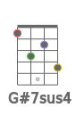    

## G#aug

                 

## G#6

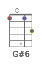                  

## G#7

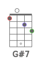               

## G#7b5

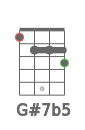    

## G#9

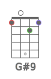  

## G#9b5

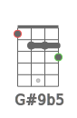    

## G#7b9

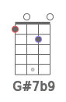 

## G#7#9

 

## G#11

 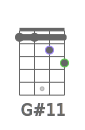    

## G#9#11

               

## G#13

   

## G#13b9

   

## G#maj7

                 

## G#maj7b5

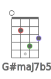      

## G#maj7#5

       

## G#maj9

           

## G#maj11

      

## G#maj13

   

## G#m6

             

## G#m7

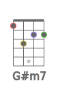           

## G#m7b5

    

## G#m9

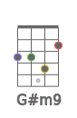   

## G#m11

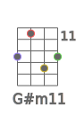 

## G#mmaj7

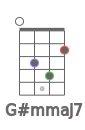           

## G#mmaj9

 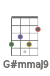            

## G#mmaj11

             

## G#add9

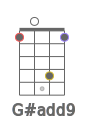           

## G#madd9

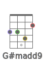   

