

	<h1>🎶 Ukulele Chords – G</h1>
	

		<strong>Tuning:</strong> GCAE
	

	

    	<a href="https://github.com/capevace/ukulele-chords"><code>ukulele-chords</code> utility tool</a>
	

	 
	

		<a href="#Gmaj">Gmaj</a> ,<a href="#Gm">Gm</a> ,<a href="#Gdim">Gdim</a> ,<a href="#Gdim7">Gdim7</a> ,<a href="#Gsus2">Gsus2</a> ,<a href="#Gsus4">Gsus4</a> ,<a href="#G7sus4">G7sus4</a> ,<a href="#Galt">Galt</a> ,<a href="#Gaug">Gaug</a> ,<a href="#G6">G6</a> ,<a href="#G69">G69</a> ,<a href="#G7">G7</a> ,<a href="#G7b5">G7b5</a> ,<a href="#Gaug7">Gaug7</a> ,<a href="#G9">G9</a> ,<a href="#G9b5">G9b5</a> ,<a href="#Gaug9">Gaug9</a> ,<a href="#G7b9">G7b9</a> ,<a href="#G7b9#5">G7b9#5</a> ,<a href="#G7#9">G7#9</a> ,<a href="#G11">G11</a> ,<a href="#G9#11">G9#11</a> ,<a href="#G13">G13</a> ,<a href="#G13b9">G13b9</a> ,<a href="#G13b5b9">G13b5b9</a> ,<a href="#Gb13b9">Gb13b9</a> ,<a href="#Gb13#9">Gb13#9</a> ,<a href="#Gmaj7">Gmaj7</a> ,<a href="#Gmaj7b5">Gmaj7b5</a> ,<a href="#Gmaj7#5">Gmaj7#5</a> ,<a href="#Gmaj9">Gmaj9</a> ,<a href="#Gmaj11">Gmaj11</a> ,<a href="#Gmaj13">Gmaj13</a> ,<a href="#Gm6">Gm6</a> ,<a href="#Gm7">Gm7</a> ,<a href="#Gm7b5">Gm7b5</a> ,<a href="#Gm9">Gm9</a> ,<a href="#Gm69">Gm69</a> ,<a href="#Gm9b5">Gm9b5</a> ,<a href="#Gm11">Gm11</a> ,<a href="#Gmmaj7">Gmmaj7</a> ,<a href="#Gmmaj7b5">Gmmaj7b5</a> ,<a href="#Gmmaj9">Gmmaj9</a> ,<a href="#Gmmaj11">Gmmaj11</a> ,<a href="#Gadd9">Gadd9</a> ,<a href="#Gmadd9">Gmadd9</a> 
	

 

## Gmaj

                

## Gm

                 

## Gdim

         

## Gdim7

  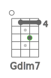    

## Gsus2

    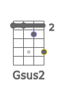               

## Gsus4

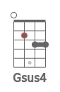                  

## G7sus4

     

## Gaug

                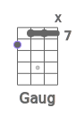   

## G6

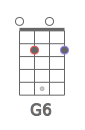               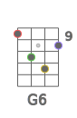          

## G7

                        

## G7b5

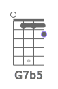      

## G9

   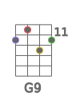 

## G9b5

      

## G7b9

    

## G7#9

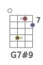 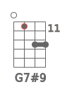  

## G11

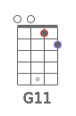     

## G9#11

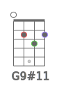                

## G13

     

## G13b9

     

## Gb13b9

   

## Gmaj7

                

## Gmaj7b5

      

## Gmaj7#5

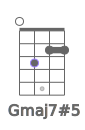      

## Gmaj9

     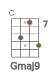       

## Gmaj11

   

## Gmaj13

  

## Gm6

         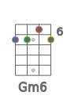  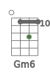          

## Gm7

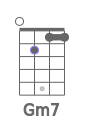             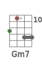      

## Gm7b5

      

## Gm9

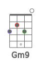       

## Gm11

   

## Gmmaj7

          

## Gmmaj9

                 

## Gmmaj11

                 

## Gadd9

            

## Gmadd9

       

