

	<h1>🎶 Ukulele Chords – Gb</h1>
	

		<strong>Tuning:</strong> GCAE
	

	

    <a href="https://github.com/capevace/ukulele-chords"><code>ukulele-chords</code> utility tool</a>
	

 
## Gbmaj

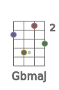 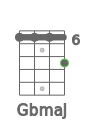 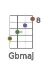 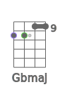 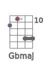 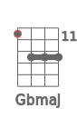 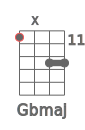 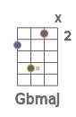 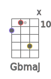 

## Gbm

  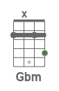  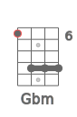 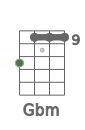 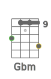 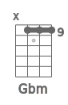  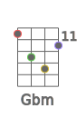 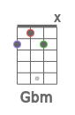 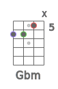 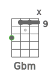 

## Gbdim

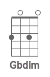 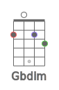  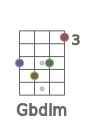 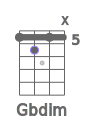 

## Gbdim7

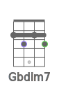 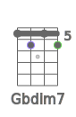  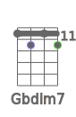 

## Gbsus2

 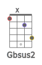 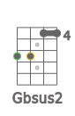 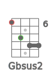 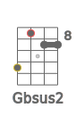 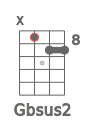  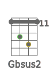 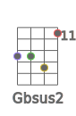 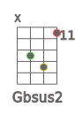 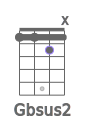 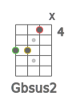 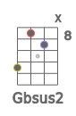 

## Gbsus4

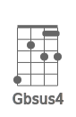  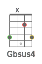 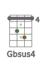 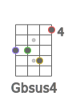 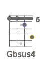 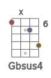 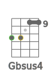 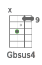 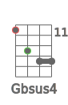 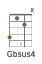 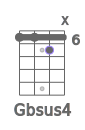 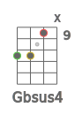 

## Gb7sus4

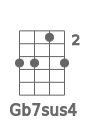  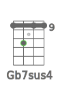  

## Gbaug

              

## Gb6

                 

## Gb7

               

## Gb7b5

    

## Gb9

  

## Gb9b5

    

## Gb7b9

    

## Gb7#9

  

## Gb11

    

## Gb9#11

             

## Gb13

   

## Gb13b9

   

## Gbmaj7

         

## Gbmaj7b5

    

## Gbmaj7#5

    

## Gbmaj9

      

## Gbmaj11

  

## Gbmaj13

## Gbm6

             

## Gbm7

             

## Gbm7b5

    

## Gbm9

   

## Gbm11

  

## Gbmmaj7

     

## Gbmmaj9

             

## Gbmmaj11

             

## Gbadd9

      

## Gbmadd9

   

